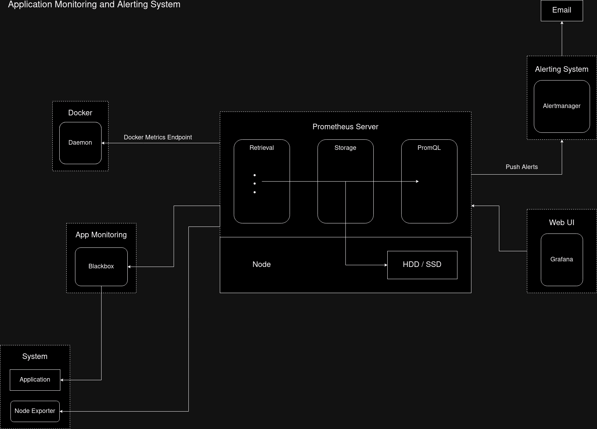

# Application Monitoring and Alerting System Using Prometheus and Alertmanager 

## Introduction

The containerized Application Monitoring and Alerting system using Prometheus, Alertmanager and several other tools to easily manage and get notified in case of failure.

## Prerequisites:

- Familiarity with [Docker](https://docs.docker.com/get-docker/), [Docker Compose](https://docs.docker.com/compose/) and Docker Networking.
- Understanding of YAML configuration files.
- [Gmail](https://myaccount.google.com/) account having 2-Step Verification turned on and keep [App password](https://myaccount.google.com/apppasswords) handy.

## Tools Used

- **Prometheus:** A systems and service monitoring system. It collects metrics from configured targets at given intervals, evaluates rule expressions, displays the results, and can trigger alerts when specified conditions are observed. Please visit [Official Website](https://prometheus.io/) or [GitHub Page](https://github.com/prometheus/prometheus) to learn more.

- **Alertmanager:** Handles alerts sent by client applications such as the Prometheus server. It takes care of deduplicating, grouping, and routing them to the correct receiver integration such as email, PagerDuty, or OpsGenie. It also takes care of silencing and inhibition of alerts. Please visit [Official Website](https://prometheus.io/docs/alerting/latest/alertmanager/) or [GitHub Page](https://github.com/prometheus/alertmanager) to learn more.

- **Blackbox Exporter:** Allows blackbox probing of endpoints over HTTP, HTTPS, DNS, TCP, ICMP and gRPC. Please visit [Official Website](https://prometheus.io/docs/guides/multi-target-exporter/) or [GitHub Page](https://github.com/prometheus/blackbox_exporter) to learn more.

## Architectural Diagram


## Setup

- This repository contains the docker-compose.yml file along with configuration files for Prometheus, Alertmanager and Blackbox Exporter.
- Take a copy of this GitHub repository using command: 
  ```bash
  git clone https://github.com/omkarsathe01/prometheus-alertmanager-blackbox-container.git
  ```

- **docker-compose.yml** file contains the launch configuration information for the containers: 
	- blackbox_exporter: Will be running on address blackbox_exporter:9115. The configuration file is located at ./blackbox_exporter/blackbox.yml
	- prometheus: Will be exposed on port http://localhost:9090. The configuration file is located at ./prometheus/prometheus.yml
	- alertmanager: Will be running on address alertmanager:9093. The configuration file is located at ./alertmanager/alertmanager.yml
	- grafana: Will be exposed on port http://localhost:3000.
	- smart_ocr (custom application): Will be exposed on port http://localhost:5001.

- **prometheus.yml** file contains Prometheus configuration:
	- In alerting flag we have alertmanager on port 9093.
	- We have the rules against which the prometheus alerts will get triggered defined in file prometheus_rules.yml
	- The metrics_path defaults to '/metrics'.
	- In scrape_configs flag we have following jobs for which we will be receiving metrics for:
		- prometheus on port 9090.
		- **docker-metrics** provides the information about the docker which can be enabled by updating daemon.json file with the given config:
		```json
		{
		  "metrics-addr": "127.0.0.1:9323"
		  "experimental": true
		}
		```
		- Reload the docker. 
		- The metrics will be available on http://localhost:9323/metrics if it doesn't work try changing `"127.0.0.1:9323"` with `"0.0.0.0:9323"`. Please visit [Official Documentation](https://docs.docker.com/config/daemon/prometheus/) to learn more.
		- Replace `<docker-metrics>` with the ip address of docker0. Use `ip addr show docker0` command to get the ip address of docker0.
		- For `- job_name: 'running-applications-blackbox'` job we are monitoring application health ideally on `/health` endpoint. Since we don't have such endpoint in our custom application we will directly monitor the `/` endpoint. Set target to the application endpoint e.g.:
		```
		static_configs:
		  - targets:
		    - http://localhost:5001/    # smart-ocr is running on this address
		```

- **prometheus_rules.yml** file contains custom rules feel free to modify it:
	- expr: flag contains the query or expression to be evaluated if results to true then the alarm will fire up.

- **blackbox.yml** file contains blackbox configuration:
	- Blackbox is currently monitoring the application over HTTP version 1.1 and 2 for the GET request and checks for 200 (OK) status code.

- **alertmanager.yml** file contains the alertmanager configuration:
	- Make sure to update `<email-address>` field with the appropriate addresses.
	- For `<app-password>` enter the App password that was generated by following the steps in Prerequisites.

- The Grafana is running on http://localhost:3000. Using Grafana we can import or create custom dashboards.
